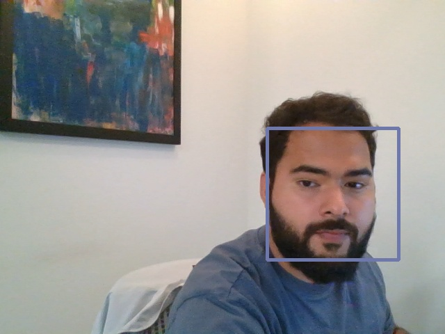
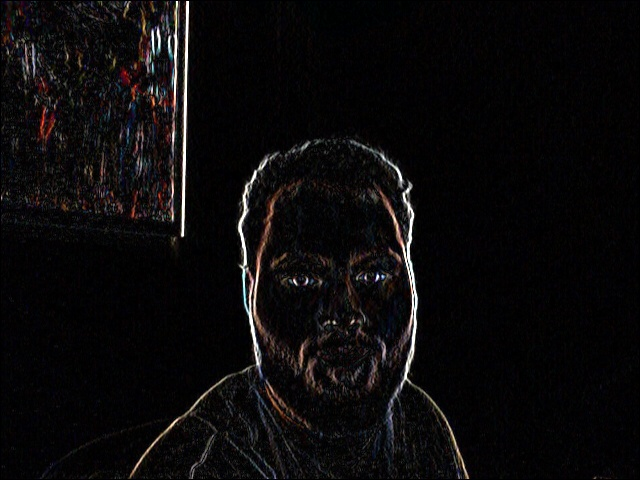
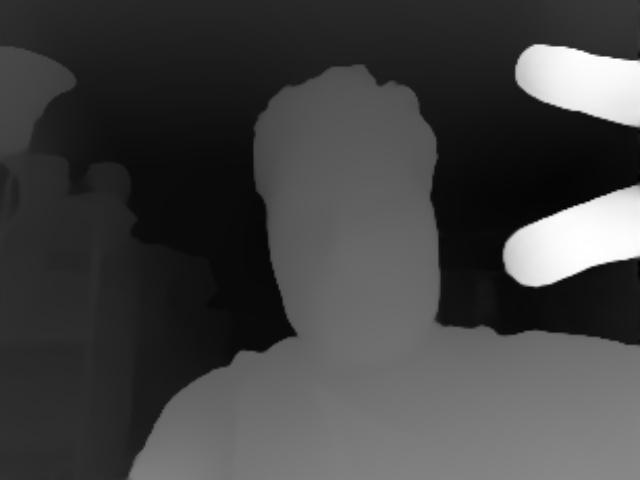

# FaceDepth-Vision

A computer vision project that combines traditional image processing with modern AI for face detection and depth estimation. Built as part of CS 5330 Computer Vision coursework.

**Authors:** Bhumika Yadav, Ishan Chaudhary  
**Course:** CS 5330 Computer Vision, Fall 2025  
**Institution:** Northeastern University  

## What This Project Does

This project started as a way to learn computer vision fundamentals, but ended up being pretty cool. It can:

- Apply various image filters (blur, edge detection, sepia, etc.)
- Detect faces in real-time using your webcam
- Estimate depth using AI (Depth Anything v2)
- Combine face detection with depth info for some neat effects

The cool part is that it blends old-school computer vision techniques with modern deep learning - you get to see how both approaches work together.

## Example Results

Here are some of the effects you can create:

### Face Detection with Background Blur

*Detects faces and blurs everything else in the background. The face stays sharp while the background gets a nice blur effect.*

### Edge Detection

*Sobel edge detection showing horizontal edges. This is one of the classic computer vision techniques - finding where brightness changes rapidly.*

### Depth Estimation

*AI-powered depth estimation. Closer objects are brighter, farther objects are darker. This uses the Depth Anything v2 model.*

## Project Structure

```
FaceDepth-Vision/
├── src/                    # Main source code
│   ├── filters.cpp         # All the image filters
│   ├── blur_benchmark.cpp  # Speed comparison between blur methods
│   ├── sobel_test.cpp      # Edge detection testing
│   └── da2_demo.cpp        # Depth estimation demo
├── faceDetect/             # Face detection stuff
│   ├── faceDetect.cpp      # Haar cascade face detection
│   └── haarcascade_frontalface_alt2.xml  # The face detection model
├── da2-code/               # Depth Anything v2 integration
│   ├── DA2Network.hpp      # Wrapper for ONNX Runtime
│   └── *.cpp               # Example code
├── results/                # Output images organized by type
└── data/                   # Sample images for testing
```

## Getting Started

### What You'll Need

1. **OpenCV** - The main computer vision library
   - Download from: https://github.com/opencv/opencv/releases
   - Or install via package manager:
     - Windows: Use the pre-built binaries
     - Linux: `sudo apt install libopencv-dev`
     - macOS: `brew install opencv`

2. **ONNX Runtime** (only if you want depth estimation)
   - Download from: https://github.com/microsoft/onnxruntime/releases
   - Get version 1.22.1 or compatible

3. **Depth Anything v2 Model** (only for depth features)
   - Download from: https://huggingface.co/depth-anything/Depth-Anything-V2-Small/tree/main
   - Get the `model_fp16.onnx` file (~47MB)
   - Put it in the `da2-code/` folder

4. **CMake** - For building the project
   - Download from: https://cmake.org/download/
   - Or install via package manager

5. **C++ Compiler**
   - Windows: Visual Studio 2019+ or MinGW
   - Linux: GCC 7+ or Clang 5+
   - macOS: Xcode command line tools

### Building

```bash
# Clone this repo
git clone https://github.com/Ishan2OO1/FaceDepth-Vision.git
cd FaceDepth-Vision

# Build it
mkdir build && cd build
cmake ..
make

# Run some demos
./bin/blur_benchmark    # Compare blur algorithms
./bin/sobel_test        # Test edge detection
./bin/da2_demo          # Depth estimation (if you have the model)
```

## How It Works

### Image Filtering

The project implements several filters from scratch:

- **Grayscale**: Custom version that inverts the red channel (just for fun)
- **Sepia**: Classic vintage photo effect
- **Blur**: Both a "naive" version and an optimized separable version
- **Sobel Edge Detection**: Finds edges using gradient calculations
- **Emboss**: Creates a 3D embossed effect

### Face Detection

Uses OpenCV's Haar cascades to detect faces. The cool part is that it can then apply different effects based on whether a pixel is inside a face or not - like blurring the background while keeping faces sharp.

### Depth Estimation

This is where it gets interesting. Uses the Depth Anything v2 model to estimate how far objects are from the camera. Then you can do things like:

- Desaturate distant objects (make them grayscale)
- Keep close objects in full color
- Create depth-based effects

The model runs in real-time on a webcam feed, which is pretty neat.

### Performance Optimizations

Learned a lot about optimization while building this:

- **Separable convolution**: Instead of a 5x5 blur kernel, do two 1D passes. Much faster.
- **Pointer arithmetic**: Direct memory access instead of using OpenCV's `at<>()` function
- **Integer math**: Avoid floating point where possible

The separable blur is about 3x faster than the naive version.

## Code Examples

### Basic Image Filtering
```cpp
#include "filters.h"

cv::Mat src = cv::imread("image.jpg");
cv::Mat dst;

// Apply custom grayscale
greyscale(src, dst);

// Apply blur
blur5x5_2(src, dst);  // The fast separable version
```

### Face Detection
```cpp
#include "faceDetect.h"

cv::Mat gray;
cv::cvtColor(src, gray, cv::COLOR_BGR2GRAY);
std::vector<cv::Rect> faces;
detectFaces(gray, faces);

// Now faces contains bounding boxes of detected faces
```

### Depth Estimation
```cpp
#include "DA2Network.hpp"

DA2Network net("da2-code/model_fp16.onnx");
cv::Mat frame, depth;

net.set_input(frame, 0.5f);  // Half resolution for speed
net.run_network(depth, frame.size());
// depth now contains the depth map
```

## What I Learned

This project was a great way to learn:

- How computer vision algorithms actually work (not just calling OpenCV functions)
- The difference between naive and optimized implementations
- How to integrate deep learning models into C++ applications
- Performance optimization techniques
- Real-time video processing

The face detection + depth estimation combo creates some really cool effects that you don't see in typical computer vision tutorials.

## Performance Notes

- **Blur algorithms**: Separable version is ~3x faster than naive
- **Depth inference**: Runs at about 10-15 FPS on a decent CPU
- **Face detection**: 30+ FPS easily
- **Memory usage**: Optimized pointer access patterns help keep it efficient

## Future Ideas

If I had more time, I'd add:

- GPU acceleration for the depth model
- More face detection algorithms (MTCNN, RetinaFace)
- Additional depth-based effects
- Multi-threading for better performance
- Mobile app version

## Credits

- **OpenCV**: For the computer vision foundation
- **Depth Anything v2**: Amazing depth estimation model
- **ONNX Runtime**: Makes it easy to run models in C++
- **Bruce Maxwell**: Course instructor who taught us the fundamentals

## License

This is a student project for educational purposes. Feel free to use the code for learning, but please don't submit it as your own work.

---

*Built with C++, OpenCV, and a lot of debugging. The combination of traditional computer vision and modern AI creates some really interesting possibilities.*